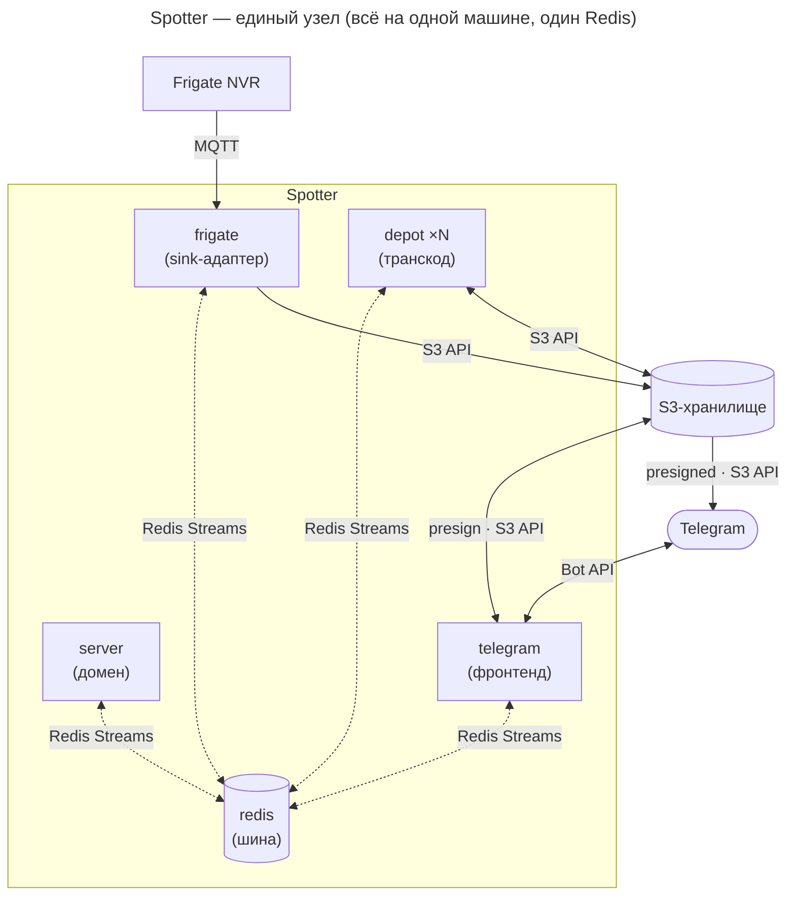
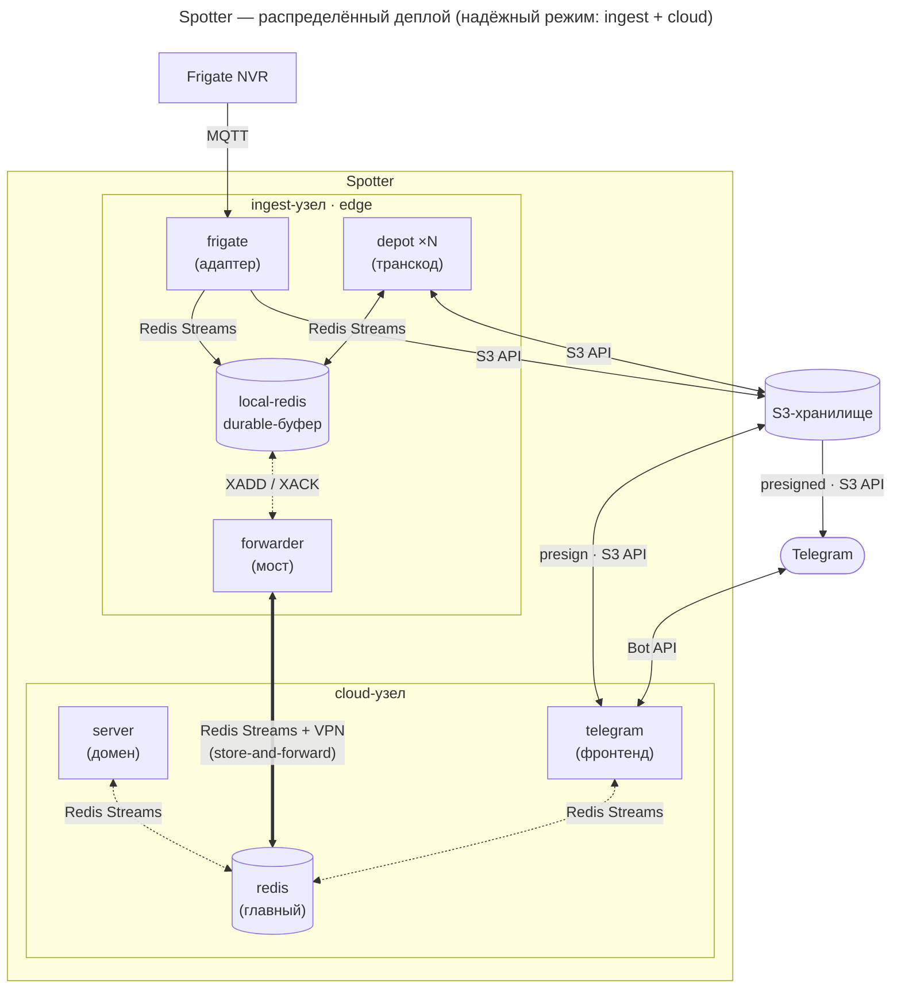

# Spotter

> Система видеонаблюдения с уведомлениями в Telegram, построенная вокруг событий [Frigate NVR](https://frigate.video/).
>
> Внутреннее имя пакетов — `spotter` / `@spotter/*`.
>
> **Open-source self-hosting:** проект рассчитан на развёртывание у себя — любой может
> поднять Spotter на своём сервере. Конфигурация — слоёные `.env` (общий + по
> сервисам) и compose-профили (см. [Развёртывание](#развёртывание-docker)).

Когда камера фиксирует событие (человек, машина, животное), Frigate публикует его в MQTT.
Spotter подхватывает событие, отправляет уведомление в Telegram, обрабатывает снимок и
крепит его прямо к сообщению. Под фото — кнопка «Видео»: по нажатию обрабатывается клип
и тем же сообщением заменяет фото.

## Архитектура

Spotter поддерживает две топологии. Пунктиром обведена **область нашего приложения**
(`apps/*` + `packages/*`); снаружи — внешние системы (Frigate NVR, Telegram) и инфраструктура
(S3, Redis, MQTT-брокер). Протоколы подписаны на рёбрах: **MQTT** (ингест из Frigate),
**Redis Streams** (весь межсервисный транспорт), **S3 API** (медиа по ключам) и
**HTTPS** (Telegram Bot API).

### Топология «единый узел» (простой режим)



### Топология «ingest + cloud» (надёжный режим, распределённо)

Сервисы разнесены на два узла, связанных VPN-туннелем. `forwarder` — единственный держатель
межсайтового канала: зеркалит стримы между `local-redis` (durable-буфер на ingest) и главным
Redis в облаке и буферизует события при обрывах (`XACK`-после-успеха).



Вся специфика NVR изолирована в адаптере (`apps/frigate`): только он знает URL-схемы
и держит креды Frigate. Адаптер стейджит сырое медиа в S3 — по сети ходят **ключи
S3, не байты и не токены**. `server`/`telegram`/`depot` работают через абстрактные контракты
(`spotter.media.request.<source>` → `*.staged` → `*_processed`); каталог камер/объектов
адаптер публикует в `spotter.catalog.<source>`.

Домен и фронтенд разнесены: **server** (headless) персистит события, оркеструет медиа,
владеет авторизацией и исполняет команды; **telegram** рендерит и шлёт сообщения, держит
Telegram-локальный стейт и пресайнит медиа. Контракт между ними — `spotter.delivery.*`
(вниз) и `spotter.command.*` (вверх, RPC).

| Сервис             | Назначение                                                                                       |
| ------------------ | ------------------------------------------------------------------------------------------------ |
| **`apps/frigate`** | NVR-адаптер. `Source` (Frigate/MQTT) ингестит события в `spotter.event`; `MediaProvider` стейджит клип/снимок/кадр в S3 по запросу; `Catalog` публикует таксономию. Единственный держатель кредов Frigate. |
| **`apps/test`**    | Синтетический адаптер для офлайн-разработки: REPL эмитит события, медиа берётся из локальных фикстур. NVR/MQTT не нужны. |
| **`apps/server`**  | Headless-домен и оркестрация. Персистит события, гоняет медиа-пайплайн, владеет recipients/авторизацией, исполняет домен-команды (RPC). NVR/Telegram не знает. |
| **`apps/telegram`** | Telegram-фронтенд (grammY). Консьюмит `delivery.*`, рендерит и шлёт/редактирует сообщения, обрабатывает команды операторов; держит Telegram-стейт и пресайнит S3-ключи. |
| **`apps/pwa`**     | PWA-фронтенд (**опциональный, основной**). Тонкий Bun-сервер: раздаёт установочное веб-приложение (Vite/React/shadcn) и пушит `delivery.event` через Web Push (VAPID) на iPhone/Android/desktop. Дедуп + коалесинг, лента/событие/сетап. Требует HTTPS. |
| **`apps/email`**   | Email-фронтенд (**опциональный**). Headless SMTP-консьюмер `delivery.event`: одно письмо на событие (`create`), presign кадра, дедуп-леджер. Добавочный канал, whitelisted-устойчив через ящик рос-провайдера. |
| **`apps/depot`**   | Медиа-процессор. Берёт сырое медиа из S3 по ключу, транскодит (ffmpeg/sharp), кладёт результат обратно в S3. NVR не знает. |
| **`apps/forwarder`** | Двунаправленный мост Redis Streams local↔remote (store-and-forward). Нужен только в распределённом деплое — см. [Развёртывание](#развёртывание-docker). |
| **`packages/sink`** | Фреймворк адаптера: порты `Source`/`MediaProvider`/`Catalog`, рантайм `runSink` (стейджинг в S3, публикация событий/каталога). |
| **`packages/transport`** | Общие абстракции транспорта: `RedisRegulator`, `StreamProducer`, `env`, `resolveRedisConfig`, `bufferToJson`, контракты `SpotterEvent` / медиа-пайплайна / каталога. |
| **`packages/stenograph`** | Структурированный логгер с контекстными саб-логгерами.                                     |

**Топология деплоя.** Архитектура рассчитана на два сценария. Простой — **всё на
одной машине** с единым Redis (dev, небольшие инсталляции). Надёжный —
**распределённый**: сервисы разносятся на два узла, **ingest** (`frigate`/`depot` +
локальный durable-Redis + `forwarder`) и **облачный** (главный Redis + `server` + `telegram`),
связанные VPN-туннелем. `forwarder` — единственный компонент, держащий хрупкий
межсайтовый канал, и буферизует события при обрывах (`XACK`-после-успеха).

Распределённый режим решает проблему ненадёжного или ограниченного канала на
стороне ingest: локальный durable-Redis принимает события и медиа даже при
отсутствии связи, а `forwarder` досылает накопленное после восстановления. Пример
такого деплоя — edge-узел на нестабильном аплинке + облачный узел со стабильным
адресом (см. [Развёртывание](#развёртывание-docker)).

Подробности по каждому сервису — в его `AGENTS.md` (например, [apps/server/AGENTS.md](apps/server/AGENTS.md) / [apps/telegram/AGENTS.md](apps/telegram/AGENTS.md)).
Гайд для AI-ассистентов и общие конвенции — в корневом [AGENTS.md](AGENTS.md).

## Технический стек

- **Рантайм:** [Bun](https://bun.sh) 1.3.14 — запуск, тесты, сборка, S3-клиент
- **Монорепо:** Turborepo + workspaces (`apps/*`, `packages/*`)
- **Транспорт:** Redis Streams (встроенный `Bun.RedisClient`, consumer groups) + MQTT (Mosquitto)
- **БД:** SQLite (`bun:sqlite`) + Drizzle ORM (split: [apps/server/src/db/schema.ts](apps/server/src/db/schema.ts) — домен, [apps/telegram/src/db/schema.ts](apps/telegram/src/db/schema.ts) — Telegram-стейт)
- **Хранилище:** любое S3-совместимое (внешний провайдер или self-hosted MinIO/Garage)
- **Telegram:** grammY (+ `hydrate`, `parse-mode`, `runner`); своя система команд (классы + роли)
- **Качество:** Biome (линт + формат), Changesets (версии), commitlint

## Быстрый старт

### 1. Зависимости

```bash
bun install
```

### 2. Окружение

**Один `.env` на узел** — compose раздаёт его всем контейнерам, лишние
переменные сервис игнорирует. Обязательны только `S3_*` и `TELEGRAM_TOKEN`;
остальное — с рабочими дефолтами.

```bash
cp .env.example .env    # для single/dev; впиши S3_* и TELEGRAM_TOKEN
```

Для распределёнки — два узловых шаблона: `.env.cloud.example` (server + telegram
+ опц. pwa/email) и `.env.ingest.example` (frigate + depot + forwarder).
NVR-креды (`FRIGATE_*`) живут ТОЛЬКО на ingest-узле и на cloud не попадают.
Per-service consumer-группы, пути БД и `SOURCE_ID` — **дефолты в коде**, в `.env`
их держать не нужно. Конфиг валидируется на старте: если обязательной переменной
нет, сервис падает с перечнем всех недостающих (`requireConfig`). Для
офлайн-разработки без Frigate: `cp .env.test.example .env.test` и адаптер
`apps/test`.

### 3. Инфраструктура (Docker)

```bash
bun run docker:dev          # redis + mosquitto (development-инфра)
# либо голым compose (docker-compose.yml — симлинк на dev-профиль):
docker compose up -d
```

> БД отдельным сервисом не нужна — это локальный SQLite-файл (свой у server и telegram).
> Миграции Drizzle применяются автоматически при старте сервиса. Подробнее о split-деплое —
> в разделе [Развёртывание](#развёртывание-docker).

### 4. Запуск сервисов

```bash
bun start                   # все сервисы параллельно через turbo
bun start:watch             # то же, с авто-перезапуском (--watch)
```

Отдельный сервис:

```bash
cd apps/telegram && bun start
```

## Команды

| Команда                     | Действие                                              |
| --------------------------- | ----------------------------------------------------- |
| `bun start`                 | Запустить все сервисы (`turbo run start --parallel`)   |
| `bun start:watch`           | Запуск с hot-reload                                    |
| `bun test`                  | Тесты во всех воркспейсах (`bun:test`)                 |
| `bun test:coverage`         | Тесты с покрытием                                      |
| `bun run build`             | Сборка всех сервисов (`bun build`)                     |
| `bun run typecheck`         | Проверка типов (`tsc --noEmit`)                        |
| `bun run sign:token`        | Создать код доступа (см. ниже)                         |
| `bunx biome check --write`  | Линт + автоформат                                      |
| `bun run docker:dev`        | Поднять dev-инфру (redis + mosquitto)                  |
| `make single`               | Поднять весь прод-стек на одной машине (redis, mosquitto, frigate, depot, server, telegram, watchtower) |
| `make ingest`               | Поднять прод-узел ingest (local-redis, mosquitto, frigate, depot×N, forwarder) |
| `make cloud`                | Поднять прод-узел cloud (redis + server + telegram)    |
| `make token`                | Выпустить код доступа admin (внутри контейнера)        |

## Авторизация

Роли: `anonymous → viewer → user → admin`. Новый пользователь всегда получает роль
`viewer` (только нотификации); роль повышает админ командами `/user_promote` / `/user_demote`.

Доступ — по одноразовым кодам, хранящимся в БД (таблица `access_tokens`). Первого админа
создаёт CLI (БД задаётся `DATABASE_PATH`):

```bash
bun run sign:token admin                       # код доступа для роли admin
# опции: -u <username> (привязка к @username), -b <bot> (добавить deep-link), -r (только код)
bun apps/server/src/cli.ts sign admin -b <bot_username>
```

Активация: оператор отправляет боту `/login <код>` либо открывает deep-link из QR-кода
(`https://t.me/<bot>?start=<код>` → автологин через `/start`). Код одноразовый.
Внутри бота админ выдаёт коды (роли `viewer`) командой `/user_sign [@username?]` —
бот присылает QR-код с deep-link.

## Redis Streams

Каждый стрим читается своей consumer-группой (`spotter-server` / `spotter-telegram` /
`spotter-depot` / `spotter-frigate`). Доставка — at-least-once: `XACK` после успешной
обработки, зависшие записи перезабираются `XAUTOCLAIM` (reaper). Группы создаются с позиции
`$` — на рестарте старое не пересылается.

Медиа-пайплайн абстрактен: server шлёт запрос в per-source стрим, адаптер стейджит
сырьё в S3, depot транскодит по ключу. По сети ходят только S3-ключи. Домен (server)
и фронтенд (telegram) общаются контрактами `spotter.delivery.*` и `spotter.command.*`.

| Стрим                              | Кто пишет | Кто читает      | Назначение                          |
| ---------------------------------- | --------- | --------------- | ----------------------------------- |
| `spotter.event`                    | frigate   | server          | Событие камеры (start/update/end)   |
| `spotter.event.test_seed`          | telegram  | frigate         | Посев тестовых событий (`/test_publish`) |
| `spotter.catalog.updated`          | frigate   | server, telegram | Снимок каталога камер/объектов       |
| `spotter.media.request.<source>`   | server    | frigate         | Стейджинг медиа события: снимок (eager на `end`) / клип (по кнопке «Видео», `event.clip`) |
| `spotter.media.staged`             | frigate   | depot           | Сырьё события застейджено в S3 (ключи) |
| `spotter.event.media_processed`    | depot     | server          | Ключи обработанного медиа в S3       |
| `spotter.camera.request.<source>`  | telegram  | frigate         | Запрос на стейджинг кадра камеры      |
| `spotter.camera.staged`            | frigate   | depot           | Кадр застейджен в S3 (ключ)          |
| `spotter.camera.frame_processed`   | depot     | telegram        | Ключ обработанного кадра в S3         |
| `spotter.delivery.event`           | server    | telegram        | Команда доставки события (create/update/media) |
| `spotter.delivery.recipient`       | server    | telegram        | Изменение роли/отзыв получателя       |
| `spotter.command.request`          | telegram  | server          | Домен-мутирующая команда (RPC)        |
| `spotter.command.reply`            | server    | telegram        | Ответ на команду (корреляция по requestId) |
| `frigate/events` *(MQTT)*          | Frigate   | frigate         | Сырые события Frigate                 |

В распределённом деплое эти стримы зеркалируются между локальным и удалённым Redis
сервисом `forwarder` — направление см. в [apps/forwarder/src/streams.ts](apps/forwarder/src/streams.ts).

## Развёртывание (Docker)

> 📖 **Быстрый старт (3 шага) и пошаговая инструкция** для всех режимов
> (разработка / единый узел / распределённо), автодеплой и VPN-туннель — в
> [docs/deployment.md](docs/deployment.md). Самый быстрый путь — мастер:
> `bun .integration/install.ts` (или в контейнере `oven/bun`).

Образы публичные (`ghcr.io/mksavin/spotter-*`) — `docker login` не нужен.
Длинные `docker compose …` спрятаны за `make` (запускается из корня репозитория,
это важно для относительных путей к `.docker`/`.deployment`):

| Профиль | Команда | Что поднимает | Узлы |
| --- | --- | --- | --- |
| **development** | `bun run docker:dev` | `redis` + `mosquitto` (инфра; приложения — на хосте через `bun start`) | одна машина |
| **production · single** | `make single` | весь стек в контейнерах: `redis`, `mosquitto`, `frigate`, `depot`, `server`, `telegram`, `watchtower` (без `forwarder`) | одна машина |
| **production · ingest** | `make ingest` | `local-redis` (durable), `mosquitto`, `frigate`, `depot×N` (опц. GPU), `forwarder`, `watchtower` | ingest-узел |
| **production · cloud** | `make cloud` | `redis` (главный durable-буфер) + `server` + `telegram` + `watchtower` | облачный узел |

По умолчанию на прод-узле крутится `watchtower` — раз в сутки авто-обновляет
`spotter-*` из реестра. Отключить: `make single WATCHTOWER=0`. `bun run docker:*`
остаются для совместимости, но ведём через `make`.

**Один узел (`single`)** — простейший прод: одна машина и ингестит с NVR, и ходит
в Telegram, единый Redis, `forwarder` не нужен.

**Распределённо (`ingest` + `cloud`)** — **две отдельные машины** (но обе можно
поднять и на одной для проверки). На ingest-узле `forwarder` зеркалит стримы в
удалённый Redis (`REDIS_REMOTE_URL`, через VPN-туннель между узлами) и обратно,
буферизуя всё в `local-redis` при обрывах. Выбирай этот режим, когда аплинк на
стороне ingest ненадёжен или ограничен.

S3 задаётся через `.env` (любой S3-совместимый бэкенд). Для ограниченных/цензурируемых
сетей в качестве туннеля — свой WireGuard, а при DPI-блокировке AmneziaWG или
XRAY-VLESS; пошагово в [docs/deployment.md](docs/deployment.md#vpn-туннель-между-узлами-только-для-распределёнки).

## Структура репозитория

```
apps/
  frigate/    NVR-адаптер: Frigate Source + MediaProvider + Catalog (на @spotter/sink)
  test/       Синтетический адаптер: REPL + локальные фикстуры (офлайн-разработка)
  server/     Headless-домен: события, медиа-оркестрация, recipients/авторизация, command-RPC
  telegram/   Telegram-фронтенд (grammY): delivery-консьюмер, рендер, команды, presign
  depot/      Медиа-процессор (ffmpeg/sharp; S3 по ключу)
  forwarder/  Двунаправленный мост Redis Streams local↔remote (распределённый деплой)
packages/
  sink/        Фреймворк адаптера: Source/MediaProvider/Catalog + runSink (стейджинг в S3)
  transport/   Абстракции транспорта (RedisRegulator) + контракты (event/медиа/каталог/delivery) + helpers
  stenograph/  Логгер
apps/server/src/db/    SQLite-схема и репозиторий (Drizzle): recipients, access_tokens, events
apps/telegram/src/db/  SQLite-схема и репозиторий (Drizzle): tg_chats, tg_bindings, event_messages
apps/{server,telegram}/drizzle/  Сгенерированные миграции Drizzle
.deployment/compose/  Compose-профили: development, production.single, production.ingest, production.cloud
.deployment/          Конфиги инфраструктуры (mosquitto, …)
Makefile              Короткие алиасы над docker compose (make single/cloud/ingest/update/logs/ps/down/token)
.env.example          Единый .env для single/dev (все сервисы, один файл)
.env.cloud.example    Шаблон cloud-узла (server + telegram + опц. pwa/email)
.env.ingest.example   Шаблон ingest-узла (frigate + depot + forwarder, NVR-креды)
.github/workflows/    CI: lint.yml (ветки) + release.yml (master)
.integration/         Bun-скрипты: install.ts (мастер), conventional.ts, imperative.ts
.changeset/           Changesets: конфиг + pending-changeset'ы
```

## CI/CD и релизы

Два GitHub Actions workflow:

| Workflow | Триггер | Что делает |
| --- | --- | --- |
| [lint.yml](.github/workflows/lint.yml) | push в любую ветку **кроме** `master` | Biome (`biome ci`), commitlint (Conventional Commits), `bun run typecheck`, `bun run test` |
| [release.yml](.github/workflows/release.yml) | push в `master` | версионирование (changesets) → git-теги + GitHub Releases → сборка/пуш Docker-образов |

### Как работает релиз

Версионирование — через [changesets](https://github.com/changesets/changesets).
Релиз идёт в **два прохода** по `master`:

1. **Накопление.** В `master` лежат **changeset-файлы** (`.changeset/*.md`) — каждый
   описывает, какие пакеты и как бампнуть (`patch`/`minor`/`major`).
   `changesets/action` видит их и **открывает PR** «chore(ci): Update packages
   versions»: внутри PR выполняется `changeset version` — поднимаются версии в
   `package.json`, пишутся `CHANGELOG.md`, использованные changeset'ы удаляются.
2. **Публикация.** Когда этот PR смержен, на следующем прогоне `release.yml`
   pending-changeset'ов больше нет → запускается `publish` (`bun run publish` =
   `bunx changeset tag`): создаются **git-теги** и **GitHub Releases**
   (`createGithubReleases: true`). В npm пакеты **не** публикуются (они приватные,
   `access: restricted`) — распространение идёт Docker-образами.
3. **Образы.** Если что-то зарелизено (`published == true`),
   [imperative.ts](.integration/imperative.ts) в режиме `--matrix` отдаёт список
   зарелизенных **приложений** (`apps/*`; у `packages/*` нет `Dockerfile`), и на
   каждое запускается **отдельная matrix-джоба** `images`, которая собирает и пушит
   свой образ в `ghcr.io/<owner>/<app>:latest` и `:<version>-alpine`.
   `fail-fast: false` — упавший образ **не отменяет остальные**, а пересобрать
   можно только его (**Re-run failed jobs**). При бампе общего пакета
   (`transport`/`stenograph`) зависящие приложения получают `patch`-бамп
   (`updateInternalDependencies: patch`) и пересобираются автоматически.

Секреты: `GH_BYPASS_TOKEN` (PAT — пуш version-PR и тегов в обход branch protection),
`GITHUB_TOKEN` (логин в ghcr.io + создание Releases).

### Как выпустить новую версию

1. Веди работу в ветке, коммить по **Conventional Commits** (`fix:` → patch,
   `feat:` → minor, `feat!:` / `BREAKING CHANGE` → major). Иначе упадёт commitlint.
2. Добавь changeset, описывающий релиз:
   ```bash
   bunx changeset            # выбрать затронутые пакеты и тип бампа
   ```
   > Опционально changeset'ы можно сгенерировать из conventional-коммитов:
   > `bun run changeset:conventional` (локально или ручным workflow
   > [changeset.yml](.github/workflows/changeset.yml)).
3. Закоммить `.changeset/*.md`, открой PR, проведи через `lint.yml`, смержи в `master`.
4. CI откроет PR «**Update packages versions**» — проверь бампы версий и `CHANGELOG`,
   смержи его.
5. На мерж этого PR `release.yml` проставит теги, создаст GitHub Releases и
   соберёт/запушит Docker-образы.

## Дорожная карта

- [x] ~~MongoDB + Prisma~~ → SQLite (`bun:sqlite`) + Drizzle
- [x] ~~Kafka~~ → Redis Streams (встроенный `Bun.RedisClient`, consumer groups)
- [x] Локальный durable-буфер + `forwarder` (store-and-forward между узлами)
- [x] Разнос compose на профили dev / single / ingest / cloud
- [ ] VPN-туннель между узлами (XRAY-VLESS / AmneziaWG 2 для ограниченных сетей); устойчивый канал telegram↔Telegram
- [ ] `frigate/events` → `frigate/reviews` (нативный батчинг уведомлений)
- [x] Видео по кнопке (on-demand транскод клипа, edit-in-place на сообщении события)
- [x] Разделение `spotter/server` (домен) + `telegram`-фронтенд (`spotter.delivery.*` / `spotter.command.*`); канал-адаптеры `vk`/`max`/`ntfy` — на будущее
- [ ] Интеграция LGTM-стека (Loki / Grafana / Tempo / Mimir)
- [ ] Устойчивость доставки под блокировки РФ — [обзор каналов и замены Telegram](.agents/plans/emergency-channels-overview.md) (модель угроз L0–L5; см. «рамку сдержанности» — делаем только PWA+SMS+email, остальное отвергнуто осознанно):
  - [x] **PWA-фронтенд + Web Push** (Vite/React/shadcn + тонкий Bun-сервер) — консьюмер `spotter.delivery.*`, пушит на iPhone/Android/Win/macOS без стора и рос-приложений — реализован в [`apps/pwa`](apps/pwa/AGENTS.md) ([план](.agents/plans/pwa-frontend.md))
  - [ ] Аварийный SMS-канал через API роутера Keenetic — одна честная гарантия «телефон зазвонит», когда IP погашен ([план](.agents/plans/sms-emergency-channel.md))
  - [x] email как добавочный канал (SMTP через ящик рос-провайдера, whitelisted-устойчив) — реализован в [`apps/email`](apps/email/AGENTS.md) ([план](.agents/plans/email-channel.md))
  - [ ] ~~LoRa/Meshtastic, whitelisted-транспорт, ham/спутник~~ — осознанно отвергнуто, берём только при реальной угрозе соте ([разбор](.agents/plans/lora-emergency-channel.md))
