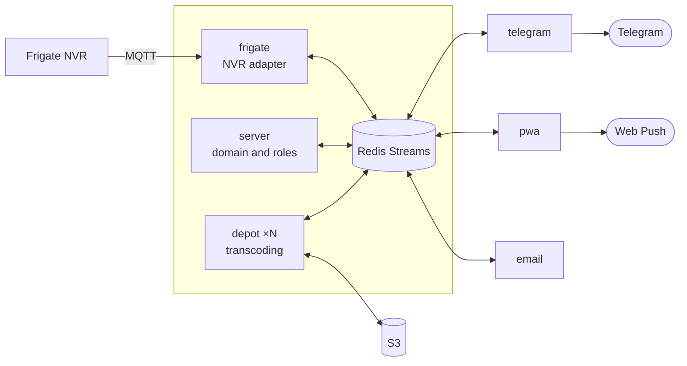

<div align="center">

# Spotter

**Alert delivery hub for your NVR.**

A reliable, all-in-one way to get event alerts into your pocket. Runs on your own hardware. Completely free.
Works with [Frigate](https://frigate.video/); delivers over Telegram, email and web push.

[](https://bun.sh)
[](https://www.typescriptlang.org/)
[](https://frigate.video/)
[](https://docs.docker.com/compose/)
[](#tests)
[](docs/deployment.md)

[Install](#install-in-five-minutes) · [What it looks like](#what-it-looks-like) · [Docs](docs/deployment.md) · [Architecture](#how-it-works)

**English** · [Русский](README.ru.md)

</div>

---

## Why Spotter

Frigate has a web interface, and a good one. But you have to **open it**. Spotter solves a different problem: getting an event to a person who isn't looking at a screen right now, and doing it reliably.

| | Built-in NVR alerts | Camera cloud services | **Spotter** |
|---|:---:|:---:|:---:|
| Footage and snapshots stay yours | ✅ | ❌ | ✅ |
| Reaches your phone when you're away | ⚠️ | ✅ | ✅ |
| Several recipients with different rights | ❌ | ⚠️ | ✅ |
| Survives a connection drop without losing events | ❌ | ⚠️ | ✅ |
| Fallback channel when the main one is down | ❌ | ❌ | ✅ |
| Subscription fee | none | yes | none |

Delivery outward does need the internet, of course — but your media stays put, and only what you send yourself ever leaves.

## What it looks like

**In Telegram.** An event arrives as a single message that fills itself in as media becomes ready: text first, then the frame, and behind a "Video" button — the clip in place of the photo. One message, not three.

**Bot commands:**

| Command | What it does |
|---|---|
| `/camera_snapshot` | a frame from a camera, right now |
| `/camera_list` | which cameras the NVR sees |
| `/timelapse` | a timelapse over a period — pick camera, dates and speed |
| `/event_info` | details for an event code |
| `/status` | what's alive, which versions, uptime |
| `/user_sign` | grant access: a code and a QR |

No need to memorise arguments: a command without them asks step by step, offering cameras and periods as buttons.

**In a browser.** An optional web app (PWA) installs to the home screen on iPhone or Android and delivers push without an App Store. Event feed, cameras, timelapses, user management. Handy as a fallback channel when Telegram is unreachable.

**By email.** One more optional channel — a message per event, over any SMTP.

## Install in five minutes

You need Docker and a working Frigate. Then one wizard, which asks about S3, your bot token and cameras, brings everything up and prints an access code:

```bash
git clone https://github.com/MkSavin/elercam.git && cd elercam
./spotter install single
```

Send the printed code to your bot with `/login <code>` — that's it, events start flowing.

```bash
./spotter logs server     # what's going on
./spotter update          # pull fresh images
./spotter token           # issue another access code
```

Details, flags and the two-machine setup are in the [deployment guide](docs/deployment.md).

## Two topologies

**Single machine** — everything side by side, the simplest option. Right when the server lives at home.

**Ingest + cloud** — cameras and transcoding stay home, the bot and domain move to a VPS. An SSH tunnel connects the nodes, and `forwarder` mirrors the bus and **buffers events while the link is down**: if the connection drops, messages pile up at home and arrive once it's back. Nothing is lost.

```bash
./spotter install cloud     # on the VPS
sudo ./spotter install ingest   # at home, the wizard sets the tunnel up itself
```

Transcoding is the demanding part, and `depot` is built to be multiplied: it holds no state, so several already share the work through one Redis consumer group. Spreading them across machines — and adding capacity on demand — is planned in the [depot scaling spec](docs/depot-scaling.md).

Switching the NVR between named modes — night, away, guests — over the bus is sketched in the [Frigate profiles spec](docs/frigate-profiles.md); it needs Frigate 0.18, which is still a release candidate.

The test rig fakes the NVR, so the MQTT hop it depends on is never exercised. Driving a real Frigate through a stub detector instead — and what that would take for a genuine end-to-end, Telegram included — is in the [real-NVR testing spec](docs/real-nvr-testing.md).

## How it works

Services know nothing about each other and talk only over Redis Streams. What travels between them is **S3 keys, not bytes and not tokens** — exactly one adapter holds camera access.



What that buys you in practice:

- **Delivery doesn't get dropped.** Acknowledgement happens only after successful processing: a message that fails stays in the queue and is retried, while a hopeless one moves to a separate stream for inspection.
- **Any service can be restarted.** Each one survives the others disappearing — including a total loss of Redis, which automatic image updates arrange on a regular basis.
- **Heavy work doesn't block urgent work.** Snapshots and video travel in separate queues, so a backlog of clips never delays the frame the notification exists for.
- **The NVR is replaceable.** Frigate sits behind an adapter port; supporting another one means a new `apps/*`, not edits across every service.

A service-by-service breakdown lives in [AGENTS.md](AGENTS.md) and in the `AGENTS.md` inside each package.

## Tests

```bash
bun test              # unit tests, a few seconds
bun run test:e2e      # end-to-end on real Redis, both topologies
bun run smoke:build && bun run test:smoke   # the real images under compose
```

Three levels, because things break at different ones. Unit tests hold the logic; end-to-end covers the bus and recovery after restarts; smoke brings up **the same images that ship to production** and catches what's only visible once deployed: a broken Dockerfile, a forgotten variable, a healthcheck that never goes green. Details in [.e2e/README.md](.e2e/README.md).

## Development

```bash
bun install
bun run docker:dev    # redis + mosquitto + minio
bun start:watch
bun run green         # types, tests and lint in one go
```

Stack: Bun, TypeScript, Redis Streams, SQLite (Drizzle), S3, grammY, React 19. Conventions and process are in [CONTRIBUTING.md](CONTRIBUTING.md).

## Roadmap

- [x] Telegram notifications with a snapshot and a clip on demand
- [x] Distributed deployment with buffering across outages
- [x] PWA with Web Push — a fallback channel without app stores
- [x] Email as an additional channel
- [x] Timelapses over an arbitrary period
- [x] Step-by-step argument prompts for commands
- [ ] SMS as a channel of last resort ([plan](.agents/plans/sms-emergency-channel.md))
- [ ] Support for other NVRs through the same adapter port

---

<div align="center">

Spotter is self-hosted and built on the assumption that you'll run it yourself.
Questions and ideas — in [issues](https://github.com/MkSavin/elercam/issues).

</div>
