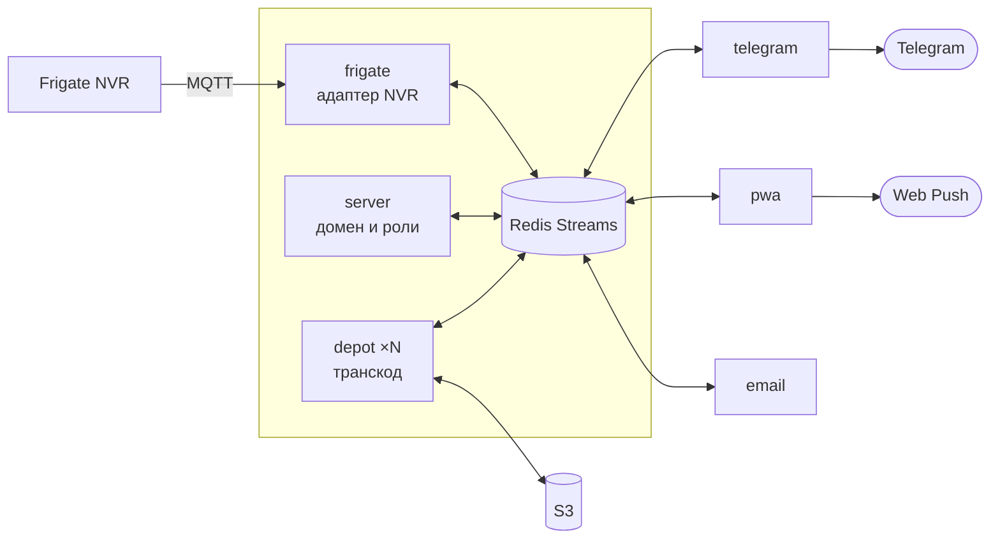

<div align="center">

# Spotter

**Центр обработки и доставки оповещений вашего NVR.**

Надёжное и комплексное решение для доставки оповещений о событиях до вашего кармана. Работает на вашем железе. Абсолютно бесплатно.
Работает с [Frigate](https://frigate.video/), доставляет в Telegram, на почту или через web-push.

[](https://bun.sh)
[](https://www.typescriptlang.org/)
[](https://frigate.video/)
[](https://docs.docker.com/compose/)
[](#тесты)
[](docs/deployment.md)

[Установка](#установка-за-пять-минут) · [Как это выглядит](#как-это-выглядит) · [Документация](docs/deployment.md) · [Архитектура](#как-это-устроено)

[English](README.md) · **Русский**

</div>

---

## Зачем это нужно

У Frigate есть свой веб-интерфейс, и он хороший. Но в него надо **зайти**. Spotter решает другую задачу: донести событие до человека, который сейчас не смотрит на экран, и сделать это надёжно.

| | Родные уведомления NVR | Облачные сервисы камер | **Spotter** |
|---|:---:|:---:|:---:|
| Записи и снимки хранятся только у вас | ✅ | ❌ | ✅ |
| Приходит на телефон, когда вы не дома | ⚠️ | ✅ | ✅ |
| Несколько получателей с разными правами | ❌ | ⚠️ | ✅ |
| Переживает обрыв связи без потери событий | ❌ | ⚠️ | ✅ |
| Запасной канал, если основной недоступен | ❌ | ❌ | ✅ |
| Абонентская плата | нет | есть | нет |

Доставка наружу интернет, разумеется, требует — но медиа лежит у вас, а наружу уходит только то, что вы отправляете себе.

## Как это выглядит

**В Telegram.** Событие приходит одним сообщением, которое достраивается по мере готовности медиа: сначала текст, потом кадр, а по кнопке «Видео» — клип вместо фото. Одно сообщение, а не три.

**Команды бота:**

| Команда | Что делает |
|---|---|
| `/camera_snapshot` | кадр с камеры прямо сейчас |
| `/camera_list` | какие камеры видит NVR |
| `/timelapse` | таймлапс за период — выбор камеры, дат и скорости |
| `/event_info` | подробности по коду события |
| `/status` | что живо, какие версии, аптайм |
| `/user_sign` | выдать доступ: код и QR |

Аргументы можно не помнить: команда без них спрашивает по шагам — камеры и периоды предлагаются кнопками.

**В браузере.** Опциональное веб-приложение (PWA) ставится на домашний экран iPhone или Android и присылает пуши без App Store. Лента событий, камеры, таймлапсы, управление пользователями. Полезно и как запасной канал, если Telegram недоступен.

**На почту.** Ещё один необязательный канал — письмо на каждое событие, через любой SMTP.

## Установка за пять минут

Нужны Docker и работающий Frigate. Дальше — один мастер, который спросит про S3, токен бота и камеры, всё поднимет и напечатает код доступа:

```bash
git clone https://github.com/MkSavin/elercam.git && cd elercam
./spotter install single
```

Отправьте напечатанный код боту командой `/login <код>` — и всё, события пойдут.

```bash
./spotter logs server     # что происходит
./spotter update          # обновиться до свежих образов
./spotter token           # выдать ещё один доступ
```

Подробности, флаги и вариант с двумя машинами — в [руководстве по установке](docs/deployment.md).

## Две топологии

**Одна машина** — всё рядом, самый простой вариант. Подходит, когда сервер стоит дома.

**Ingest + cloud** — камеры и транскодинг остаются дома, бот и домен переезжают на VPS. Между узлами SSH-туннель, а `forwarder` зеркалит шину и **буферизует события при обрыве связи**: канал упал — сообщения копятся дома и доезжают, когда связь вернётся. Ничего не теряется.

```bash
./spotter install cloud     # на VPS
sudo ./spotter install ingest   # дома, туннель мастер настроит сам
```

## Как это устроено

Сервисы не знают друг о друге и общаются только через Redis Streams. Между ними ходят **ключи S3, а не байты и не токены** — доступ к камерам есть ровно у одного адаптера.



Что это даёт на практике:

- **Доставка не теряется.** Подтверждение только после успешной обработки: упавшее сообщение остаётся в очереди и повторяется, а безнадёжное уходит в отдельный поток для разбора.
- **Любой сервис можно перезапустить.** Каждый переживает исчезновение остальных — включая полную потерю Redis, что регулярно устраивает авто-обновление образов.
- **Тяжёлое не мешает срочному.** Снимки и видео едут по разным очередям, поэтому очередь клипов не задерживает кадр, ради которого уведомление и нужно.
- **NVR заменяем.** Frigate спрятан за портом адаптера; поддержать другой — это новый `apps/*`, а не правки во всех сервисах.

Подробный разбор по сервисам — в [AGENTS.md](AGENTS.md) и в `AGENTS.md` внутри каждого пакета.

## Тесты

```bash
bun test              # юнит-тесты, несколько секунд
bun run test:e2e      # сквозные на настоящем Redis, обе топологии
bun run smoke:build && bun run test:smoke   # настоящие образы в compose
```

Три уровня, потому что ломается на разных. Юниты держат логику; сквозные — шину и восстановление после перезапусков; smoke поднимает **те же образы, что уезжают в прод**, и ловит то, что видно только в развёрнутом виде: сломанный Dockerfile, забытую переменную, healthcheck, который не зеленеет. Подробности — в [.e2e/README.md](.e2e/README.md).

## Разработка

```bash
bun install
bun run docker:dev    # redis + mosquitto + minio
bun start:watch
bun run green         # типы, тесты и линт разом
```

Стек: Bun, TypeScript, Redis Streams, SQLite (Drizzle), S3, grammY, React 19. Конвенции и процесс — в [CONTRIBUTING.md](CONTRIBUTING.md).

## Дорожная карта

- [x] Уведомления в Telegram со снимком и клипом по кнопке
- [x] Распределённый деплой с буферизацией на обрывах
- [x] PWA с Web Push — запасной канал без сторов
- [x] Email как добавочный канал
- [x] Таймлапсы за произвольный период
- [x] Диалоговый ввод аргументов команд
- [ ] SMS как канал последней надежды ([план](.agents/plans/sms-emergency-channel.md))
- [ ] Поддержка других NVR через тот же порт адаптера

---

<div align="center">

Проект self-hosted и рассчитан на то, что вы поднимете его у себя.
Вопросы и предложения — в [issues](https://github.com/MkSavin/elercam/issues).

</div>
